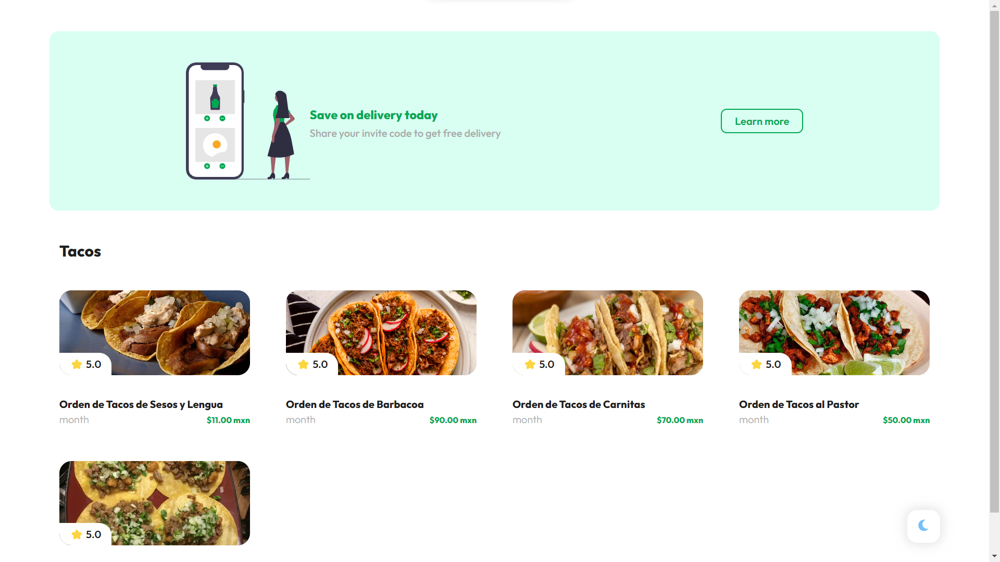

# TacoMex Payments - A Stripe API-Powered Taco Ordering Platform

> **Important:** A valid card number providen by Stripe is _4242 4242 4242 4242 4242_

## Description

TacoMex Payments is a web page that offers a seamless and secure online taco ordering experience, powered by the Stripe API. This personal programming project showcases my skills in web development and integration with payment gateways.

## Features

- **Seamless Checkout:** TacoMex Payments integrates the Stripe API to facilitate smooth and secure payment processing for each order.

- **Payment Methods:** Customers can pay using various payment methods, such as credit/debit cards or PayPal.

- **Responsive Design:** TacoMex Payments is built with a responsive design, ensuring an enjoyable ordering experience on desktops, tablets, and mobile devices.

## Technologies

Development

- JavaScript
- Css 3
- Html 5

Design

- Anything

Other

- Markdown

## Author

Created by _**@Nicolas-dev**_
